# world-model-final

Scientists have studied human behavior and came up with an idea: Human brain has created a model based on their experience and the information they get on that moment (visual signal, for example). This model allows humans to predict what is going to happen. It is slightly different from predicting the future, our brain predicts the future sensory data that might come into our brain, and lets our body react to the predicted scenario. The paper gives us the example of a baseball player. In a professional game, a pitcher can throw the ball so fast that the batter has milliseconds to decide how to react. The time is even shorter than the visual signal to reach the brain. However, most professional batters can make their swing automatically. Their brain and muscle memory reacts before they actually make a plan on how to swing.

The researcher took the idea of the model in our brain and developed the world model. The world model consists of three main models: Vision model, Memory RNN and the Controler. Here the Vision model is like our eye. It processes the visual inputs and passes it to the “brain”. Memory RNN is like our brain, which makes the prediction based on the information passed by the Vision model. Controller is like our body in the context, which  receives the prediction from Memory RNN, and makes the final action. 
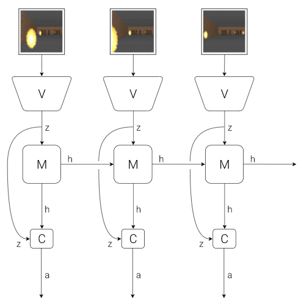

The vision model of our world model processes the visual input, it acts like our eye. In the real world, each moment the information our eyes get can be seen as a picture. the same concept applies to our V model. the input to it is a snapshot of a video sequence. The model researchers use is called Variational Autoencoder, or VAE. What the model do is to encode the image at time t into a low dimensional vector zt, while this vector zt have enough information to be decoded and recover the image at time t. This recovery process is not perfect, but is good enough for our task. I think this process is similar to PCA in machine learning, where we can map out data to a lower dimensional vector, where this vector can keep most of the significant information and can massively reduce the computational expense.

while we have zt computed by Vision model, the Memory RNN model’s job is to process the zt and use it to predict zt+1. Consider that environment might be stochastic, our M model will output p(zt+1) instead of zt+1. More specifically, it will output P(zt+1|at,zt,ht)., where at is the action taken at t, and h is the hidden state at t. The model looks like this:
	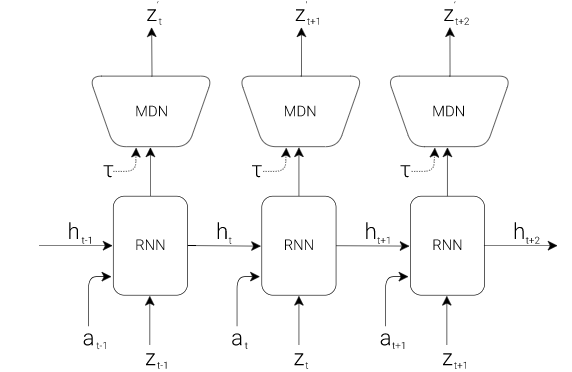
	
In the figure there is also a variable τ, it is called the temperature parameter, which controls the randomness of the environment. I will talk about this parameter in more detail later. Generally, a model trained in an environment with more randomness is able to get a better result, considering that it is trained in an environment that is harder than the actual situation.

The controller’s job is to decide which action to take given the prediction z to reach the maximum profit. We want to make our controller as simple as possible, and trained separately from the V model and M model. The researcher gives a linear model:

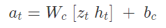

where z and h are given by the M model and, w and b are weight and bias. The V and M need to be trained with the back propagation algorithm, and the researchers designed the C to be easily trained compared to V and M. The light workload of training C gives the researcher the freedom of different ways in training C, and gets the best result with the CMA-ES algorithm.

The paper offers us two training examples of their model.
	
The first example is the car racing example. This is like a car racing game, the possible actions of a car is to steer left, steer right, accelerate and brake. The goal of the agent is to visit as many tiles as possible and be as quick as possible. First we collect 10000 random tracks, let the agent randomly drive around the environment and record its actions and results. The dataset is used to train the V model. The V model should be able to encode the images to z so that the image decoded from z has minimal difference from the original image. After V is trained, we can use the result z from V to and the actions from the random trials to train the M model. Neither V nor M know how good they behave, only controller C has access to the reward system. The job of the controller C is to maximize the cumulative reward. The researchers tried to let the controller only consider the results from V model, therefore controller have equation:
	
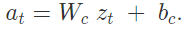

The result shows that the car can finish the track, but not well enough. The score reaches 632+-251, which has no improvement over other models. with the involvement of M model, the result gets much better. it reaches 906+-21, which became the state of art.

Under the fact that the M model can predict the future, the researchers are able to take one step ahead: make the agent dream. The agent can keep predicting the future track, and train itself in its imagination. The researchers start to test if the agent can train itself in its dream and make use of the experience back in the real environment. And here comes the VizDoom experiment.
	
In the VizDoom environment, the agent stays in a room, where on the other side of the room there are multiple monsters shooting fireballs at the agent. The agent’s goal is to keep alive, or not to be hit by the fireball. The setup is pretty similar to the car racing environment, except that the M model not only predicts zt, but also a binary variable done, which records if the agent dies. So the general process is to first collect 10000 random rollouts, train V to encode the frames, train M to predict P(z) and P(done), and pass them to the controller to maximize the survival time. After learning from raw video data, the agent learns how to play the game. We have introduced the temperature variable τ before. Here the temperature variable is getting useful. We adjust the temperature to introduce more randomness to the movement of the fireball and train the agent in that environment. Agents may die only because they are unlucky. It is shown that agents trained in a harder environment usually behave better in an easier environment. This training policy avoids the agent from cheating. In games, there are usually ways to cheat: to achieve a high score without using the skill that the game developer wants players to learn. Players always find tricks for them to reach higher scores easily. The same problem happens to agents too. Over a long time of training, the agent will have a high possibility to find a place that the fireball can never reach, and stays there forever. This is obviously not the result we want to see. Adding randomness solves it. While the game is so hard that movement of the fireballs can be random, the agent has to learn the skill instead of using some trick to pass.
	
The researcher also introduced an iterative training approach. The two examples given above are quite simple. However, there might be environments that are more complicated. Here we can try to do iterative training: First we initialize M model and C model with random parameters, and we will rollout to the environment N times, save the actions and observations, and use them to train M model to predict:

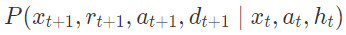

and use the C model to access the reward system. If the task is not done, we will repeat all the process from rolling out to the environment. notice that in M we are predicting , which stand for reward. Our M model will need to predict reward in an iterative model. The approach gives the model a natural hierarchical way to learn.

There are limitations to the world model presented in the paper. First limitation comes from the V model as VAE. It usually encodes useless information to z since it encodes the whole frame. We have to train both V and M to help V know what information is important. While bounded with M, the V model gives better results on the given task, but therefore cannot be applied to other tasks without retraining. Another limitation is the capacity of the model. It cannot store all the information. It also suffers from catastrophic forgetting. After all, we have not yet designed a model that is as perfect as the human brain.

# task 2

The paper gathered 10000 rollouts for the training. I did not end up getting so many rollouts due to the limitation of the CPU. I collected 5300 rollouts and trained the model for about 5 days.

The graph below shows the result of my VAE training. The one on the left is the original image and the one on the right is the image reconstructed. From my point of view my VAE works well as the two images looks close enough:

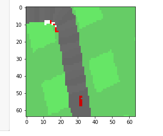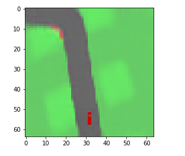

 In the graph below the blue line represents my results and the orange line represents the result produced by the original researcher. In my training period I got 100 generations and I failed to get my result as good as the one produced by the researcher. However, my result does have a rising potential. I believe the difference between my result and the research happened due to the lack of rollouts, and the lack of time.
 
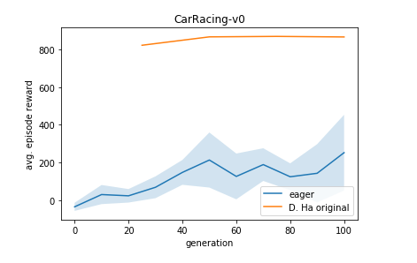

# task 3
basically how VAE work is that it have an encoder and a decoder, and we are trying to optimize our loss function

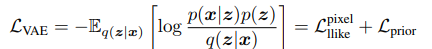

GAN, or Generative Adversarial Network, on the other hand, works with a generator Gen(z) and a discriminator Dis(x). What the generator does is to keep generating pictures with given input z, and what the discriminator does is to guess if the picture it receives is a real picture or a picture generated by the Gen(z). The Dis(x) will return a probability y in range [0,1], where 1 means x is 100% real and 0 means the picture is 100% fake. We will train the generator and the discriminator together. What we want to see in the end is that the discriminator always returns 0.5, which means the generator becomes so powerful, that it is impossible for the discriminator to tell the difference between a real picture and a generated picture.

The researcher observed that it is possible to combine the two approaches together, thus can hopefully take the advantage of GAN’s highly quality model and use VAE as the encoder. In the loss function of VAE above, we have the loss function of “pixel Ilike” as part of it. Now we will replace that with 

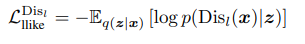

and now our new loss function become

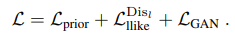

and we can train VAE and GAN together. to represent it in a graph, our procedure is:

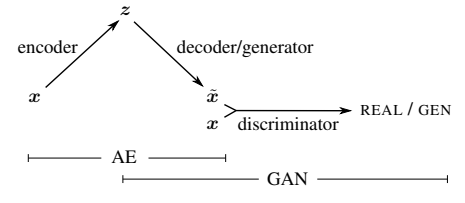

Implementation of GAN-VAE:

AS mentioned from the paper, the GAN-VAE has the decoder of the Conv-VAE as the generator of GAN. The structure we used for task 2 is a convolutional VAE which looks very similar to the conv VAE from Tensorflow tutorial, with the encoder and the decoder. What I did is to slightly modify the conVAE, add the discriminator into the structure, and change the loss function to make it measure the loss of the new GAN-VAE structure. I used the data generated from task 2, and trained the new GAN-VAE with them. I also modified the following “series.py” and asked it to now implement GAN-VAE instead of the VAE.

Due to the rush of time, I did not train my model for a long time. I trained my VAE-GAN for about 12 hours and RNN for about 12 hours. The result I get can hardly be considered satisfying. Due to the lack of training time, I think my VAE-GAN model is not as good as my original VAE result. Below is the result of my VAE-GAN.

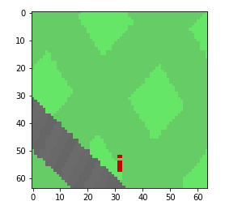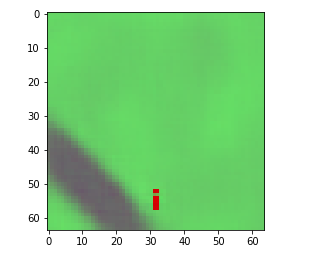

here is my evaluation result

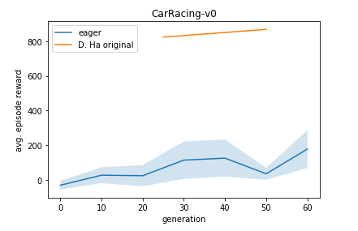

as we can see the result of my VAE-GAN is not as good as my Conv-VAE. It is hard for me to conclude if the VAE is a better approach since my GAN-VAE trained for just 1/3 of the time my VAE trained for.

